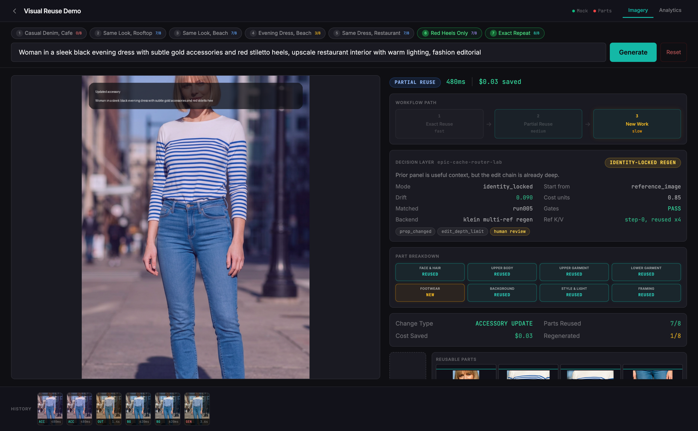
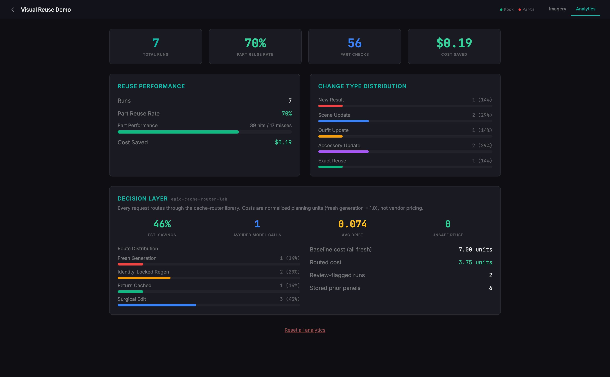

# Visual Reuse Demo

[](https://github.com/clitvinsky/compositional-caching-demo/actions/workflows/ci.yml)


A small, offline demo that shows a simple product idea: when a user makes a related image request, some visible parts of the prior result can be reused while only the changed parts are refreshed.

The rendering pipeline is intentionally mock-only, with deterministic demo responses and static image assets. The routing decisions are real: every request goes through
[epic-cache-router-lab](https://github.com/clitvinsky/epic-cache-router-lab), a tested cache-routing and continuity-evals library, and the UI shows its decision next to the visual result.



*The "Red Heels Only" preset: the visual diff is one accessory, but the router escalates to identity-locked regeneration because the edit chain is already deep. Route, rationale, drift, continuity gates, risk flags, and the FLUX.2 klein backend profile are all visible per request.*

## What It Shows

- **New result:** first request in a session.
- **Scene update:** same outfit and subject, different setting.
- **Outfit update:** same subject, different clothing.
- **Accessory update:** small change to footwear.
- **Repeat:** exact same request reused.
- **Decision layer:** the route the cache router chose, its rationale, continuity drift, and normalized cost per request.
- **Analytics:** run count, reuse rate, refreshed parts, illustrative cost savings, and router-level route distribution and cost avoidance.

## Decision Layer

The demo composes two repos. This one supplies the workflow and visuals; the
routing logic is imported from
[epic-cache-router-lab](https://github.com/clitvinsky/epic-cache-router-lab)
and used as a real dependency, not a copy.

`router_bridge.py` maps each prompt onto the router's continuity metadata.
The workflow is subject-centric, so the scene and photographic style map to
continuity tags, outfit items map to props, and the subject and framing stay
constant. Every generated result is stored as an accepted prior panel; edit
chains deepen `edit_depth`, regenerations reset it.

Running the seven presets in order produces this arc:

| Preset | Route | Why |
|---|---|---|
| Casual Denim, Cafe | `fresh_generation` | no prior work |
| Same Look, Rooftop | `surgical_edit` | scene tag changed, shallow chain |
| Same Look, Beach | `surgical_edit` | scene tag changed, edits from the original |
| Evening Dress, Beach | `identity_locked_regen` | outfit change on a depth-1 edit chain |
| Same Dress, Restaurant | `surgical_edit` | scene swap from the fresh regen |
| Red Heels Only | `identity_locked_regen` | accessory change, but the chain is deep again |
| Exact Repeat | `return_cached` | exact match, continuity gates pass |

The two `identity_locked_regen` escalations are the point: a naive parts
pipeline would keep patching, but the router's edit-depth gate forces a
clean regeneration before drift accumulates. Session analytics report the
cost of the routed plan against an everything-fresh baseline (46% avoided
on the preset arc), average drift, and an unsafe-reuse tripwire that stays
at zero while routing behaves.



Costs are normalized planning units from the router's cost model, separate
from the illustrative dollar figures in the visual pipeline.

### Backend Profile: FLUX.2 klein

Each route also carries a documented execution profile for a real backend,
Black Forest Labs' FLUX.2 klein: fresh generations map to 4-step klein-4b
text-to-image, edit routes map to klein-9b-kv multi-reference editing where
reference-token K/V is computed once at step 0 and reused across the
denoising steps of that request (BFL publishes 1.21-2.66x for this).

That reference-KV reuse is intra-request execution acceleration; the
decision layer works across requests. The two compose and are deliberately
kept distinct. Details, the full route-to-execution table, and licensing
notes (klein-4b is Apache 2.0; the 9B variants including 9b-kv are FLUX
Non-Commercial) are in [docs/backend_profiles.md](docs/backend_profiles.md).
No model is downloaded or called; the demo stays mock and deterministic.

## Project Layout

| Path | Purpose |
|---|---|
| `app.py` | FastAPI mock API and deterministic image/part generation |
| `router_bridge.py` | Maps prompts to epic-cache-router-lab requests and tracks session panels |
| `backend_profiles.py` | Documented route-to-FLUX.2-klein execution mapping |
| `static/` | Browser UI |
| `assets/source_character.png` | Local demo reference image |
| `tests/` | Decision-layer and API tests |
| `docs/DEMO_SCRIPT.md` | Short talk track for the demo |

Generated files are ignored by git:

- `output/`
- `assets/parts_manifest.json`
- `__pycache__/`

## Quick Start

```bash
git clone <repo-url>
cd visual-reuse-demo

python -m venv .venv
source .venv/bin/activate
pip install -r requirements.txt

uvicorn app:app --host 127.0.0.1 --port 5000 --reload
```

Open:

```text
http://127.0.0.1:5000/demo
```

The root path also opens the demo:

```text
http://127.0.0.1:5000/
```

## Demo Flow

Use the preset chips at the top of the UI:

1. **Casual Denim, Cafe**  
   First request. Expected result: `NEW RESULT`, `0/8` reused.

2. **Same Look, Rooftop**  
   Same outfit and subject, different setting. Expected result: `7/8` reused.

3. **Same Look, Beach**  
   Another scene update. Expected result: `7/8` reused.

4. **Evening Dress, Beach**  
   Outfit changes. Expected result: `3/8` reused.

5. **Same Dress, Restaurant**  
   Same outfit, new setting. Expected result: `7/8` reused.

6. **Red Heels Only**  
   Small accessory change. Expected result: `7/8` reused.

7. **Exact Repeat**  
   Same prompt again. Expected result: `8/8` reused.

Watch the **Decision Layer** card update on each run; then open the
**Analytics** tab to see the session summary, including the router's route
distribution and cost avoidance.

## Tests

```bash
pip install -r requirements-dev.txt
pytest
```

## Docker

Build:

```bash
docker build -t visual-reuse-demo .
```

Run:

```bash
docker run --rm -p 5000:5000 visual-reuse-demo
```

Open:

```text
http://127.0.0.1:5000/demo
```

## License

MIT. See `LICENSE`.
